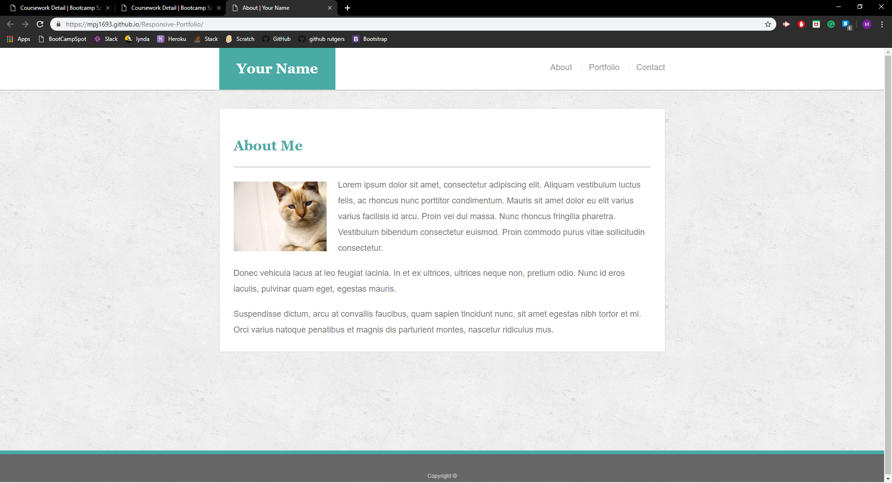
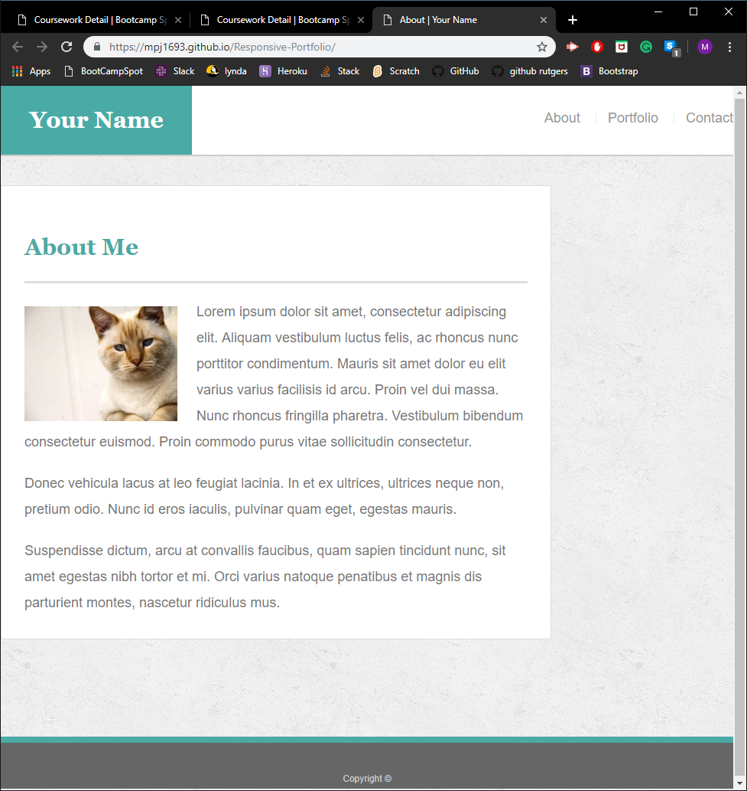
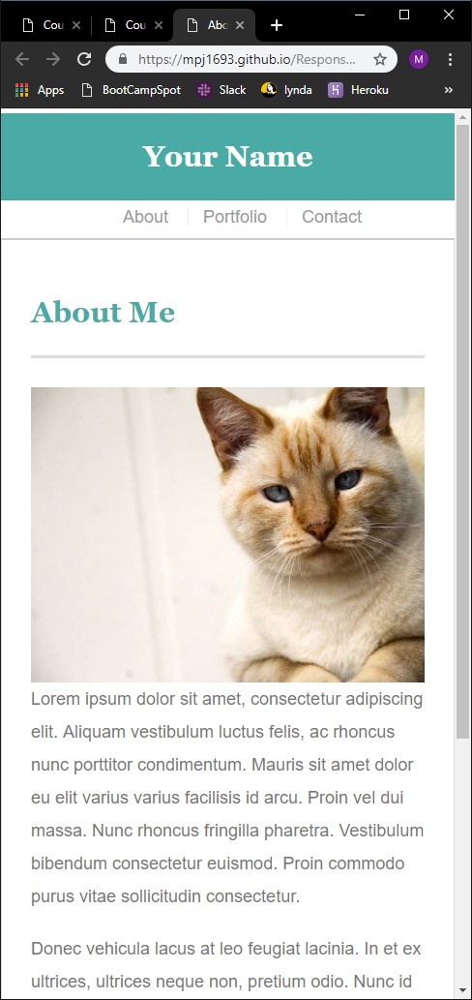

# Responsive-Portfolio

### Overview

This is an example of a responsive portfolio. It has multiple pages.

### Languages

* HTML
* CSS

### Explaination

* The portfolio has three pages. All three pages are responsive.
  1. About
  2. Portfolio
  3. Contact
* When it is opened in a large sized screen, the page will be centered and will have a lot of padding on its left and right.

* When it is opened in a medium sized screen, the page will move to the left of the window and the width is changed accordingly.

* When it is opened in a small sized screen, all the content will loose it's padding on its left and right. 

### Author

Manav Patel
